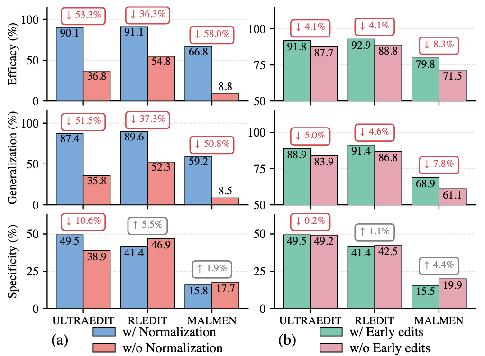
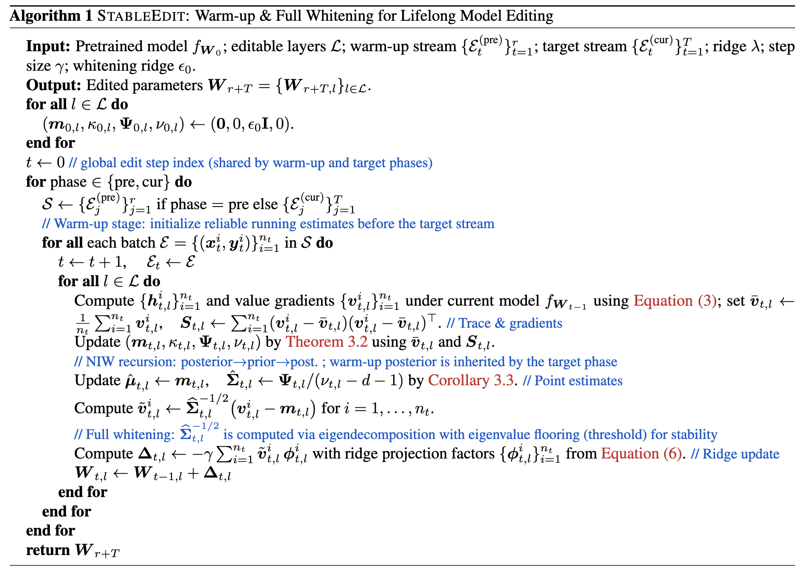

# StableEdit

Official code for the ICML 2026 paper **More Edits, More Stable: Understanding the Lifelong Normalization in Sequential Model Editing**.

## Overview

Sequential model editing must continuously inject new facts while preserving previously edited knowledge and general model behavior. In long editing horizons, existing methods often suffer from catastrophic forgetting and model collapse.

This project studies the mechanism behind long-horizon stability and introduces **StableEdit**, a method built on two main observations:

- Lifelong editors that remain stable over many editing steps share a common normalization mechanism, which we call **Lifelong Normalization (LN)**.
- Early edits can have a **positive cumulative effect**, improving the stability of later edits instead of hurting them.

Based on the theoretical analysis in the paper, StableEdit strengthens lifelong stability through:

- an explicit warm-up stage for running statistics
- full whitening of editing features
- ridge-regularized updates with bounded norms and improved orthogonality

<p align="center">
  
  
</p>

## Highlights

- A theoretical account of why LN stabilizes lifelong sequential editing.
- A practical editor, `StableEdit`, with minimal overhead over existing pipelines.

## Repository Structure

```text
.
├── config/              # Hydra configs for datasets, models, and editors
├── data/                # Dataset loaders and raw data directory
├── editor/              # Editing algorithms
├── glue_eval/           # Downstream evaluation scripts and subsets
├── main.py              # Main entry point
├── model.py             # Model loading utilities
├── nets.py              # Core auxiliary network components
├── run.sh               # Example launch script
├── requirements.txt
└── README.md
```

## Environment Setup

Create a virtual environment and install the dependencies.

```bash
conda create -n stableedit python=3.10
conda activate stableedit
pip install torch==2.3.0+cu121 --index-url https://download.pytorch.org/whl/cu121
pip install -r requirements.txt
```

## Data Preparation

Raw data should be placed under `data/raw/` with the following layout:

```text
data/raw/
├── known_1000.json
├── fever/
│   ├── fever_train.json
│   ├── fever_eval_20k.json
│   └── fever_eval_100k.json
├── ultraeditbench/
│   ├── UltraEditBench_train_20k.json
│   └── UltraEditBench_2M.json
├── wikibigedit/
│   ├── wikibigedit_train_17k.json
│   ├── wikibigedit_eval_17k.json
│   └── wikibigedit.json
└── zsre/
    ├── zsre_train.json
    ├── zsre_eval_20k.json
    └── zsre_eval_100k.json
```


## Quick Start

The simplest way to launch an experiment is:

```bash
sh run.sh
```

The current example in `run.sh` launches StableEdit on `zsre` with `mistral-7b`. An equivalent direct command is:

```bash
python main.py dataset=zsre model=mistral-7b editor=stableedit num_seq=200 \
    num_seq_zsre=20 \
    editor.cache_dir=cache \
    editor.lr=1e-6 \
    editor.alpha=10 \
    editor.RunningMeanStd_mode=stable \
    editor.preheat_mode=start \
    editor.batch_size=512 \
    dataset.batch_size=10 \
    dataset.n_edits=100 \
    model.edit_modules="[model.layers.28.mlp.down_proj, model.layers.29.mlp.down_proj, model.layers.30.mlp.down_proj, model.layers.31.mlp.down_proj]"
```

Below are the explanations for each argument:

- `dataset`: dataset name, such as `zsre`, `fever`, `wikibigedit`, or `ultraeditbench`
- `model`: model preset, such as `Mistral-7B-v0.3`, `Llama-3-8B-Instruct`, `GPT-J-6B`, or `Qwen2.5-7B-Instruct`
- `editor`: editing method, such as `StableEdit`, `ULTRAEDIT`, `RLEdit`, `MALMEN`, or `MEND`
- `num_seq`: total number of sequential editing steps during evaluation
- `num_seq_zsre`: number of warm-up steps used for `zsre`, `fever`, and `ultraeditbench`
- `num_seq_wikibigedit`: number of warm-up steps used for `wikibigedit`
- `dataset.n_edits`: number of edit instances per sequential step
- `dataset.batch_size`: mini-batch size for preparing edit tuples
- `editor.batch_size`: batch size used inside the editor when solving parameter updates
- `editor.lr`: editing step size
- `editor.alpha`: ridge regularization strength in `StableEdit`
- `editor.RunningMeanStd_mode`: running-statistics mode for lifelong normalization ('stable' for `StableEdit`, 'original' for `ULTRAEDIT`)
- `editor.preheat_mode`: warm-up position for statistics initialization, one of `start`, `q1`, `middle`, `q3`, `end`, or `none`
- `editor.cache_dir`: directory used to store intermediate cached keys and value gradients
- `model.edit_modules`: target modules to be edited
- `downstream_eval_steps`: optional interval for GLUE-style downstream evaluation


## Acknowledgements

This repository is built on prior work in lifelong model editing and benefits from the open-source ecosystem around sequential editing research. We especially thank the [ULTRAEDIT](https://github.com/XiaojieGu/UltraEdit) project for their contributions to the field.

## Contact

For questions about the paper or code, please contact `xinma@mail.ustc.edu.cn`.

## Citation

If you find this work useful, please cite:
```bibtex
@misc{ma2026editsstableunderstandinglifelong,
      title={More Edits, More Stable: Understanding the Lifelong Normalization in Sequential Model Editing}, 
      author={Xin Ma and Wei Chen and Qi Liu and Derong Xu and Zhi Zheng and Tong Xu and Enhong Chen},
      year={2026},
      eprint={2605.11836},
      archivePrefix={arXiv},
      primaryClass={cs.LG},
      url={https://arxiv.org/abs/2605.11836}, 
}

